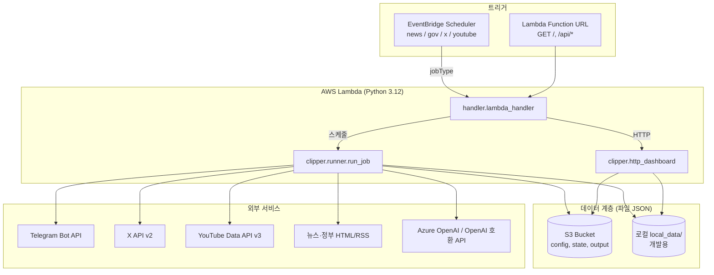

# 대외정책 뉴스 클리핑 (서버리스)

단일 AWS Lambda가 EventBridge 스케줄과 HTTP(읽기 전용 대시보드)를 함께 처리합니다. 설정·상태·실행 결과는 **S3**(로컬은 `local_data/`)에 JSON으로 저장하며 **DB는 사용하지 않습니다**.

---

## 시스템 아키텍처

### 설계 원칙

| 항목 | 내용 |
|------|------|
| **저장소** | 관계형 DB 없음. 설정·상태·아티팩트는 모두 **JSON 파일**로 S3(또는 로컬 `local_data/`)에 보관 |
| **단일 함수** | `handler.lambda_handler` 하나가 **스케줄 실행**과 **HTTP(Function URL)** 를 동일 진입점에서 처리 |
| **비밀** | AWS에서는 **Secrets Manager** ARN(`AppSecretArn`)으로 API 키·토큰 주입, 로컬은 `.env` |
| **부트스트랩** | S3에 `config/`가 비어 있으면 배포 패키지의 `config/`를 첫 실행 시 복사 |

### 논리 구성도



### 실행 경로

1. **스케줄(EventBridge)**  
   `template.yaml`에 정의된 `rate`/`cron`이 Lambda를 호출하고, 이벤트 본문에 `jobType`(예: `news`, `gov`, `x`, `youtube`)이 포함됩니다. `handler`는 이를 파싱한 뒤 `run_job(storage, job_type)`을 실행합니다.

2. **HTTP(Function URL)**  
   API Gateway 없이 Lambda Function URL로 GET만 허용합니다. `clipper.http_dashboard.handle_http_event`가 경로에 따라 HTML 대시보드(`/` ) 또는 JSON API(`/api/dashboard`, `/api/items`)를 반환합니다. **쓰기·관리 API는 없고 읽기 전용**입니다.

3. **로컬**  
   - `python cli.py run --job …` → 동일한 `run_job` 파이프라인, 스토리지는 `LOCAL_DATA_ROOT`(기본 `local_data`).  
   - `python local_server.py` → 개발용 HTTP 서버로 대시보드 확인.

### 스토리지 추상화 (`clipper.storage`)

- 환경 변수 `S3_BUCKET`이 있으면 **S3Storage**(boto3), 없으면 **LocalFileStorage**.  
- 모든 설정·런타임 상태는 **키 경로 규약**으로 구분합니다 (`config/`, `state/`, `output/…`).

### Job별 파이프라인 요약

| Job | 수집 | 후처리 | 텔레그램 형식 |
|-----|------|--------|----------------|
| `news` / `gov` | HTML 소스 프로필(`clipper.parsers`) + 키워드 필터 | 중복 제거(`dedupe`), 체크포인트 | 제목 + 링크 |
| `x` | X API로 최근 트윗 | LLM으로 관련성 판정 | 본문 + 링크 + 근거 |
| `youtube` | 채널/검색·메타 | LLM 요약 | 요약 + 링크 |

`runner.py`가 대시보드 스냅샷(`state/dashboard_snapshot.json`), 전송 이력(`state/sent_items.json`), 실패/성공 아티팩트(`output/…`)를 갱신합니다.

### AWS 배포 리소스 (`template.yaml`)

- **S3**: 데이터 버킷(암호화 AES256).  
- **Serverless Function**: 타임아웃 900초, 메모리 1024MB, `Secrets Manager` 읽기 + S3 CRUD.  
- **Function URL**: `AuthType: NONE`(대시보드 공개 시 네트워크·WAF 등 별도 보안 설계 필요).  
- **스케줄**: job별로 서로 다른 주기(예: X는 10분, 뉴스는 4시간 등).

### 의존성 스택

- **런타임**: Python 3.12, AWS SAM 서버리스 변환.  
- **라이브러리**: `boto3`, `requests`, `beautifulsoup4`/`lxml`, `openai`, `python-dotenv`, 테스트는 `pytest`.

---

## 요구 사항 요약

- **텔레그램**: 뉴스/공공은 **제목+링크**, X는 **본문+링크+판정 근거**, 유튜브는 **요약+링크**
- **수집 job**: `news`, `gov`, `x`, `youtube` — 소스·키워드는 `config/`에 고정(임의 축소 금지)
- **UI**: 단일 HTML 페이지 + `/api/dashboard`, `/api/items`

## 로컬 실행

```powershell
cd DX_handson
python -m venv .venv
.\.venv\Scripts\Activate.ps1
pip install -r requirements.txt
```

### 설정 파일 (권장)

1. 저장소에 **`.env.example`** 이 있음. 루트에 **`.env`** 를 두고 값을 채운다 (`.env` 는 gitignore 됨).
2. 이미 **`.env`** 가 생성되어 있으면 `AZURE_OPENAI_API_KEY`, `TELEGRAM_*`, `TWITTER_BEARER_TOKEN`, `YOUTUBE_API_KEY` 등 **비어 있는 항목만** Azure 포털·BotFather 등에서 발급해 넣는다.
3. 앱은 `clipper/secrets.py` 로드 시 **자동으로 `.env` 를 읽는다** (`python-dotenv`).

환경 변수(선택, 비밀이면 Secrets Manager와 병행):

- `LOCAL_DATA_ROOT` — 기본 `local_data`
- `TELEGRAM_BOT_TOKEN`, `TELEGRAM_CHAT_ID`
- **LLM (둘 중 하나)**  
  - **Azure OpenAI(권장)**: `AZURE_OPENAI_ENDPOINT`(예: `https://<리소스>.cognitiveservices.azure.com/`), `AZURE_OPENAI_API_KEY`, 선택 `AZURE_OPENAI_DEPLOYMENT`(기본 `lewis-gpt-5`), `AZURE_OPENAI_API_VERSION`(기본 `2024-12-01-preview`), `AZURE_OPENAI_MAX_TOKENS`(기본 `4096`)  
  - Azure가 **없을 때만** OpenAI 호환 HTTP: `OPENAI_API_KEY`, 선택 `OPENAI_API_BASE`, `OPENAI_MODEL`
- `TWITTER_BEARER_TOKEN` — X API v2
- `YOUTUBE_API_KEY` — Data API v3(채널·검색·동영상 메타)

`AZURE_OPENAI_ENDPOINT`와 `AZURE_OPENAI_API_KEY`가 모두 있으면 X·유튜브 요약은 **항상 Azure OpenAI**를 쓴다.

### Job 한 번 실행

```powershell
python cli.py run --job news
```

### 읽기 전용 대시보드(로컬)

```powershell
python local_server.py
# 브라우저: http://127.0.0.1:8765/
```

## AWS 배포

1. Secrets Manager에 JSON 시크릿 생성(예: 키 이름은 템플릿 `AppSecretArn`에 연결):

   - `TELEGRAM_BOT_TOKEN`, `TELEGRAM_CHAT_ID`, `OPENAI_API_KEY`, `TWITTER_BEARER_TOKEN`, `YOUTUBE_API_KEY`

2. SAM 빌드·배포:

   ```powershell
   sam build
   sam deploy --guided
   ```

3. Lambda에 **함수 URL**(또는 API Gateway)을 붙여 GET `/` 대시보드를 노출합니다. `template.yaml`에는 버킷·스케줄·시크릿 권한이 포함되어 있습니다.

4. 첫 실행 시 S3 버킷에 `config/`가 비어 있으면 배포 패키지의 `config/`가 복사됩니다(`bootstrap`).

## 디렉터리

| 경로 | 설명 |
|------|------|
| `config/` | sources, keywords, filters, telegram, prompts |
| `state/` | checkpoints, sent_items, source_health, dashboard_snapshot |
| `output/runs|items|failed/YYYY/MM/DD/` | 실행·항목·실패 로그 JSON |

## 문서

- [구현 계획](docs/implementation-plan.md)
- [소스 인벤토리](docs/source-inventory.md)
- [결정 사항](docs/decisions.md)
- [운영 런북](docs/runbook.md)

## 테스트

```powershell
pytest -q
```
