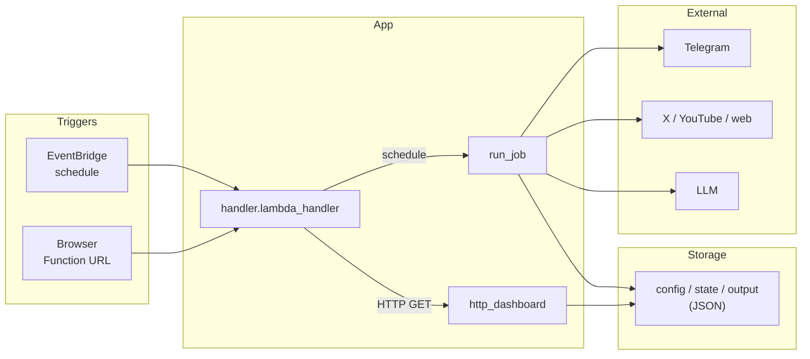
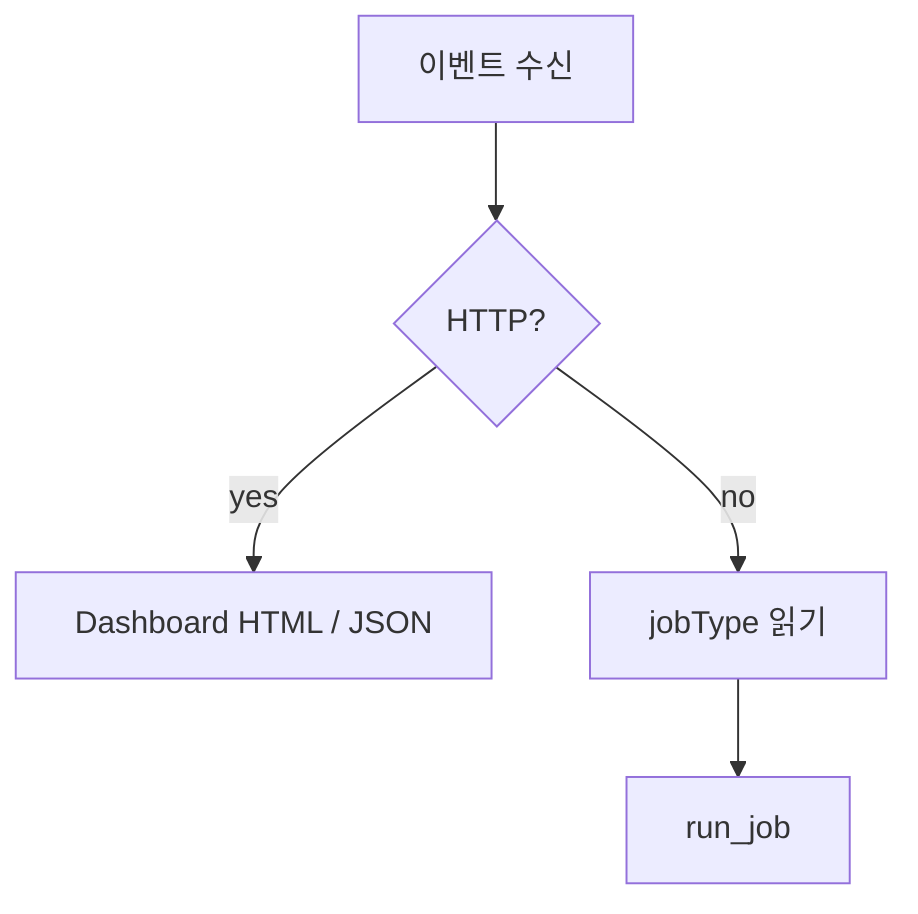
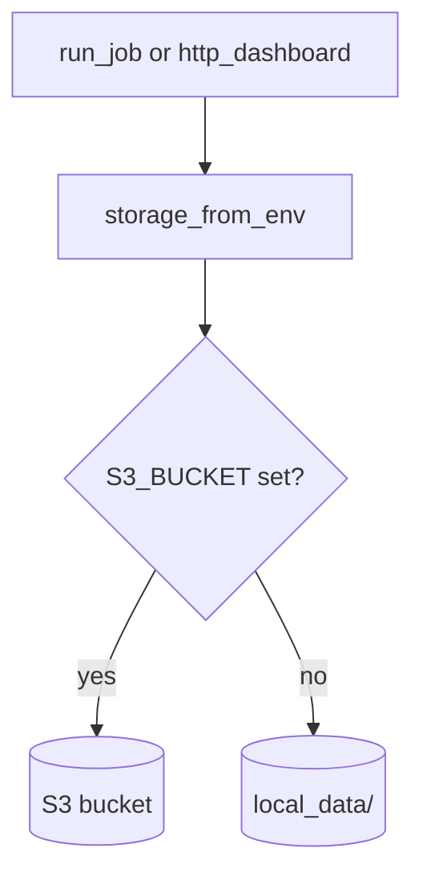

# 대외정책 뉴스 클리핑 (Serverless)

정책·에너지·대외 이슈를 **웹·SNS·YouTube**에서 자동으로 모으고, 조건에 맞으면 **Telegram**으로 알려 줍니다.

이 프로젝트는 **로컬에서 먼저 전부 검증한 다음, 별도 앱을 짜지 않고 Lambda 기반 AWS에 그대로 올릴 수 있게** 맞춰 둔 설계입니다. PC에서는 폴더·`.env`로 돌리고, 배포 후에는 **같은 코드**가 **S3 + Secrets Manager** 환경에서 **Lambda**로 돌아갑니다(아래 *개발·배포 흐름*·*설계 취지* 참고).

---

## 개발·배포 흐름 (로컬 → AWS Lambda)

| 단계 | 하는 일 | 비고 |
|------|---------|------|
| **1. 로컬 검증** | `pytest` · `cli.py run --job …` · `local_server.py`로 job·대시보드·설정이 기대대로인지 확인 | 데이터는 `local_data/`(또는 `LOCAL_DATA_ROOT`) |
| **2. AWS 배포** | `sam build` → `sam deploy` 로 **Lambda + S3 + EventBridge + Function URL** 구성 | `template.yaml` 단일 스택 |
| **3. 운영** | EventBridge가 스케줄·`jobType`으로 Lambda 호출, 대시보드는 **Function URL** GET | 비밀은 **Secrets Manager**, 객체는 **S3** |

- **앱 본문(`handler.py`, `clipper/*`)은 로컬과 AWS가 공유**합니다. “클라우드 전용” 분기·복제 코드를 두지 않습니다.  
- **달라지는 것**은 대개 환경 변수뿐입니다(예: `S3_BUCKET` / `APP_SECRET_ARN` 유무, 로컬은 `.env`).

---

## 기능 개요

| 구분 | 내용 |
|------|------|
| **Job 종류** | `news`, `gov`, `x`, `youtube` 네 가지. 소스·키워드는 **`config/`**가 기준이며 임의로 줄이지 않습니다. |
| **Telegram 형식** | 뉴스·공공: **제목 + 링크** / X: **본문 + 링크 + AI 판단 근거** / YouTube: **요약 + 링크** |
| **대시보드** | **읽기 전용**. HTML 한 페이지 + JSON: `/api/dashboard`, `/api/items` |
| **소스** | 뉴스·공공 다수, X는 대통령실 계정(`config` URL 기준), YouTube는 KTV 등 — [`docs/source-inventory.md`](docs/source-inventory.md) 참고 |

**한 줄 요약:** 지정 소스 → 필터 → **Telegram**, 실행 결과는 **대시보드**에서 확인합니다.

---

## 설계 취지

과제·hands-on에 맞게 **단순하고 가볍게** 가져갑니다. **“로컬에서 테스트 → SAM으로 Lambda에 배포”** 를 기본 루트로 삼습니다.

1. **구성 요소는 최소로**  
   **Lambda 함수 하나**가 스케줄 job과 HTTP(대시보드)를 함께 처리합니다. DB 대신 **JSON 파일**만 둡니다.

2. **로컬과 AWS가 같은 코드**  
   클리핑은 **`run_job` 하나**입니다. 로컬은 `local_data/`, AWS는 **S3**에 같은 key layout. **`S3_BUCKET` 유무만** 보면 됩니다.

3. **비밀은 코드 밖에**  
   로컬은 **`.env`**, AWS는 **Secrets Manager** JSON을 Lambda가 읽습니다.

4. **UI는 얇게**  
   별도 프론트 빌드 없이 **HTML + JSON** 응답, **API Gateway** 없이 **Lambda Function URL**에 **GET**만 노출합니다.

5. **LLM은 갈아끼울 수 있게**  
   X / YouTube 후처리는 **Gemini · Azure OpenAI · OpenAI 호환** — `LLM_PROVIDER` 등으로 고릅니다(아래 환경 변수).

**정리:** 함수 하나 + 파일 저장 + 외부 API. 인프라는 늘리지 않았습니다.

---

## 아키텍처 개요

### 전체 그림



- **들어옴:** (1) 스케줄 payload의 `jobType`으로 Lambda invoke, (2) 사용자가 **Function URL**로 **GET**만 호출.  
- **나감:** Telegram 메시지, S3 또는 로컬에 남는 **실행 기록·대시보드 스냅샷**.

### 진입점: HTTP vs 스케줄

`handler.lambda_handler`가 HTTP인지 먼저 판별합니다.



- **HTTP:** `local_server.py`도 같은 **`lambda_handler`** 사용 → 로컬·배포에서 대시보드 경로 동일.  
- **스케줄:** `news` · `gov` · `x` · `youtube` 중 하나만 실행.

### 저장소: 로컬과 S3

DB 없이 **같은 path 규칙**을 디렉터리와 S3에 적용합니다.



| 경로 | 역할 |
|------|------|
| `config/` | 소스 URL, 키워드, 필터, prompts |
| `state/` | checkpoint, sent items, dashboard snapshot |
| `output/…` | 실행·항목·실패 로그(날짜별 JSON) |

### Job별 요약

| Job | 처리 | Telegram |
|-----|------|----------|
| `news` / `gov` | HTML fetch + 키워드 필터 | title + link |
| `x` | X API + LLM relevance | body + link + reason |
| `youtube` | KTV 검색 + LLM 요약 | summary + link |

### AWS 구성 (`template.yaml`)

- S3 버킷 1, Lambda 1, **EventBridge**로 job마다 주기, **Function URL** (템플릿엔 인증 없음 — 실서비스는 **WAF** 등 권장).  
- Runtime: Python 3.12, IAM: Secrets Manager + S3 read/write.

### 사용 패키지

`boto3`, `requests`, `beautifulsoup4`, `lxml`, `openai`, `google-generativeai`, `python-dotenv`, `pytest`.

---

## 로컬과 AWS의 차이

| | 저장 | job 실행 | 대시보드 |
|---|------|----------|----------|
| **로컬** | `S3_BUCKET` 없음 → `local_data/` | `python cli.py run --job …` | `python local_server.py` → handler 동일 |
| **AWS** | `S3_BUCKET` → S3 | EventBridge → Lambda | Function URL, GET only |

바뀌는 것은 **환경 변수**와 **스토리지 뒤단**뿐입니다. **`clipper.runner` / `clipper.storage` 로직은 동일**합니다.

---

## 로컬에서 실행

```powershell
cd DX_handson
python -m venv .venv
.\.venv\Scripts\Activate.ps1
pip install -r requirements.txt
```

### 환경 변수

1. **`.env.example`**을 복사해 **`.env`**로 저장하고 값을 넣습니다.  
2. `clipper/secrets.py`가 **`python-dotenv`**로 `.env`를 불러옵니다.

**자주 쓰는 변수**

- `LOCAL_DATA_ROOT` — 기본 `local_data`  
- `TELEGRAM_BOT_TOKEN`, `TELEGRAM_CHAT_ID`  
- **`LLM_PROVIDER`**: `auto` (기본) · `gemini` · `azure` · `openai`  
  - `auto`: YouTube는 `GEMINI_API_KEY`가 있으면 Gemini 우선; X는 Azure → OpenAI → Gemini  
- `GEMINI_API_KEY`, 선택 `GEMINI_MODEL` — [Google AI Studio](https://aistudio.google.com/apikey)  
- `AZURE_OPENAI_ENDPOINT`, `AZURE_OPENAI_API_KEY`, 선택 deployment / API version / max tokens  
- `OPENAI_API_KEY`, 선택 `OPENAI_API_BASE`, `OPENAI_MODEL`  
- `TWITTER_BEARER_TOKEN`, `YOUTUBE_API_KEY`

### job 한 번 돌리기

```powershell
python cli.py run --job news
```

### 로컬 대시보드

```powershell
python local_server.py
# http://127.0.0.1:8765/
```

---

## AWS에 배포

1. **Secrets Manager**에 JSON 시크릿을 만들고 **`AppSecretArn`**에 연결합니다(키 이름은 위 env와 같게).  
2. `sam build` → `sam deploy --guided`  
3. Lambda **Function URL**로 대시보드( GET `/` )에 접속합니다.  
4. S3에 `config/`가 없으면 배포 패키지의 `config/`를 한 번 **bootstrap**합니다.

---

## 관련 문서

- [구현 계획](docs/implementation-plan.md)  
- [소스 목록(인벤토리)](docs/source-inventory.md)  
- [결정 사항](docs/decisions.md)  
- [운영 런북](docs/runbook.md)

## 테스트

```powershell
pytest -q
```
