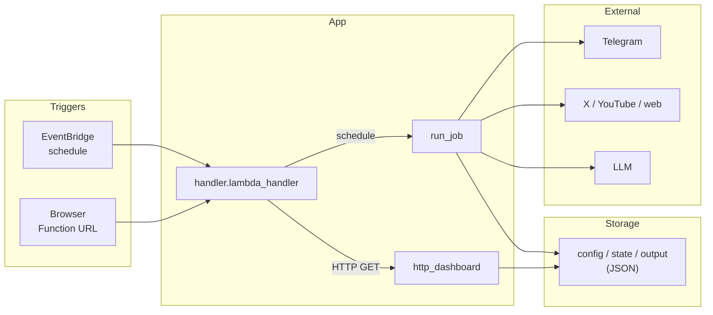
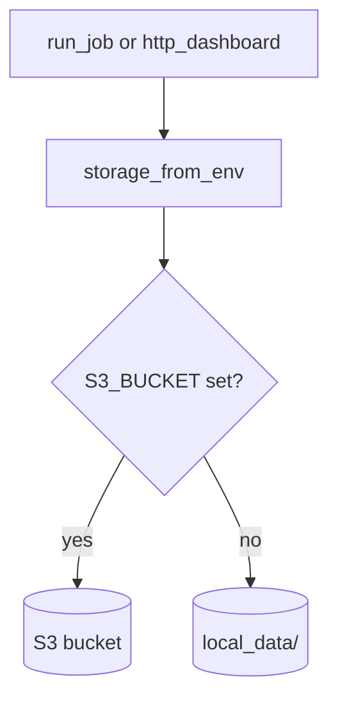

# 대외정책 뉴스 클리핑 (Serverless)

정책·에너지·대외 이슈를 **웹·SNS·YouTube**에서 수집하고, 조건에 맞을 경우 **Telegram**으로 알림을 전송합니다.

본 저장소는 **로컬에서 동작을 검증한 뒤, 동일 애플리케이션 코드를 AWS Lambda 기반으로 배포**할 수 있도록 구성되어 있습니다. 개발 시에는 로컬 디렉터리와 `.env`를 사용하고, 운영 배포 후에는 **S3·Secrets Manager·Lambda** 환경에서 동일 코드가 실행됩니다(아래 *개발·배포 흐름*, *설계 취지* 참조).

---

## 개발·배포 흐름 (로컬 → AWS Lambda)

| 단계 | 작업 | 비고 |
|------|------|------|
| **1. 로컬 검증** | `pytest`, `cli.py run --job …`, `local_server.py`로 job·대시보드·설정 동작 확인 | 데이터 경로: `local_data/` 또는 `LOCAL_DATA_ROOT` |
| **2. AWS 배포** | `sam build` → `sam deploy`로 **Lambda, S3, EventBridge 규칙, Function URL** 프로비저닝 | `template.yaml` 단일 CloudFormation 스택 |
| **3. 운영** | EventBridge가 스케줄·`jobType` 페이로드로 Lambda 호출, 대시보드는 **Function URL** 경유 **GET** | 자격 증명: **Secrets Manager**, 객체 저장: **S3** |

- **애플리케이션 코드**(`handler.py`, `clipper/*`)는 로컬과 AWS에서 **공유**합니다. 환경 전용 분기나 중복 구현은 두지 않습니다.  
- **차이**는 주로 **영속화 경로**와 **시크릿 주입 방식**입니다. 로컬에서는 환경 변수(`.env`)가 우선하고, AWS에서는 동일 키를 **Secrets Manager** JSON에서 로드할 수 있습니다(`clipper/secrets.py`의 `get_secret`). 배포된 Lambda의 `S3_BUCKET`, `APP_SECRET_ARN`은 **CloudFormation 템플릿이 주입**합니다.

---

## 기능 개요

| 구분 | 내용 |
|------|------|
| **Job** | `news`, `gov`, `x`, `youtube`. 소스·키워드는 **`config/`**가 단일 기준이며 임의 축소하지 않습니다. |
| **Telegram** | 뉴스·공공: 제목+링크 / X: 본문+링크+AI 판단 근거 / YouTube: 요약+링크 |
| **대시보드** | 읽기 전용. HTML 단일 페이지 및 JSON API: `/api/dashboard`, `/api/items` |
| **소스** | 뉴스·공공 다수, X(대통령실 계정, `config` URL 기준), YouTube(KTV 등) — 상세는 [`docs/source-inventory.md`](docs/source-inventory.md) |

**요약:** 지정 소스 수집 → 필터링 → **Telegram** 발송, 실행 결과는 **대시보드**에서 조회합니다.

---

## 설계 취지

**단순성·경량화**를 우선하며, **로컬 검증 → SAM 기반 Lambda 배포**를 표준 절차로 둡니다.

1. **최소 구성**  
   **단일 Lambda 함수**가 스케줄 기반 job과 HTTP(대시보드) 요청을 모두 처리합니다. 관계형 DB 대신 **JSON 파일**로 상태·설정을 보관합니다.

2. **코드 단일화**  
   클리핑 로직은 **`run_job` 단일 진입점**입니다. `clipper.storage.storage_from_env()`는 **`S3_BUCKET` 미설정 시** 로컬 디렉터리(`LOCAL_DATA_ROOT`, 기본값 `local_data/`), **설정 시** S3를 사용합니다. 로컬 개발 중 **`S3_BUCKET`을 설정하면** 실제 AWS 버킷에 연결되므로 주의가 필요합니다.

3. **시크릿 관리**  
   로컬: **`.env`**. AWS: **Secrets Manager**에 JSON 저장 후 Lambda가 참조합니다.

4. **프레젠테이션 계층**  
   별도 SPA 빌드 없이 **HTML·JSON** 응답, **API Gateway** 없이 **Lambda Function URL**에 **GET**만 노출합니다.

5. **LLM 추상화**  
   X·YouTube 후처리에 **Gemini / Azure OpenAI / OpenAI 호환** 엔드포인트를 선택할 수 있도록 **`LLM_PROVIDER`** 등으로 구성합니다(아래 환경 변수).

**설계 요약:** 단일 함수 + 파일 기반 저장소 + 외부 API 연동. 불필요한 인프라 구성요소는 배제했습니다.

---

## 기술 스택 및 구성 요소

아래는 **본 서비스**에서 사용하는 구성 요소와 그 **역할**입니다.

### AWS (운영 환경)

| 구성 요소 | 역할 |
|-----------|------|
| **AWS Lambda** | 전용 VM 운영 없이 **이벤트 구동**으로 Python 핸들러(`handler.py`)를 실행하는 **서버리스 컴퓨트**입니다. |
| **EventBridge (규칙 기반 스케줄)** | SAM `Schedule` 이벤트가 **EventBridge Rule**을 생성하여, 지정 주기·cron에 따라 동일 Lambda 함수를 **invoke**합니다. (별도 관리형 서비스인 **EventBridge Scheduler**와는 구분됩니다. 본 템플릿은 **규칙 + 스케줄 표현식** 패턴입니다.) |
| **Amazon S3** | **객체 스토어**에 설정·상태·로그를 **JSON 객체**로 저장합니다(관계형 DB 미사용). |
| **AWS Secrets Manager** | API 키·토큰 등 **시크릿**을 저장하며, Lambda 실행 시 `GetSecretValue`로 조회합니다(소스 코드 내 하드코딩 없음). |
| **Lambda Function URL** | Lambda에 **HTTPS 엔드포인트**를 부여합니다. **API Gateway** 없이 대시보드용 **GET** 요청을 처리합니다. |
| **AWS SAM** | `template.yaml`(IaC)로 Lambda·S3·스케줄·IAM 등을 **일관 배포**합니다(`sam build` / `sam deploy`). |

**스케줄링과 cron**  
- **온프레미스 호스트의 crontab**은 해당 서버 가용성·타임존·장애 대응을 팀이 직접 관리해야 합니다.  
- 본 아키텍처에서는 **EventBridge Rule의 스케줄 표현식**으로 동일 요구를 **관리형 서비스**에 위임하고, 주기 변경은 템플릿 또는 콘솔에서 조정합니다.  
- **로컬 개발** 환경에는 EventBridge가 없으므로, **`python cli.py run --job …`**로 동일 비즈니스 로직을 수동 실행합니다.

### 런타임·SDK

| 구성 요소 | 역할 |
|-----------|------|
| **Python 3.12** | Lambda 런타임과 로컬 실행 환경을 일치시킵니다. |
| **boto3** | S3, Secrets Manager 등 **AWS API** 호출용 공식 SDK입니다. |

### 수집·HTTP·HTML

| 구성 요소 | 역할 |
|-----------|------|
| **requests** | 뉴스 사이트, X API v2, YouTube Data API 등 **HTTP 클라이언트** 용도입니다. |
| **BeautifulSoup4, lxml** | 수집한 **HTML**에서 링크·제목 등 구조화 정보를 **파싱**합니다. |

### LLM

| 구성 요소 | 역할 |
|-----------|------|
| **google-generativeai** | **Gemini** API. `LLM_PROVIDER=auto`일 때 YouTube 요약은 `GEMINI_API_KEY`가 있으면 우선 사용하고, X 처리에서는 Azure·OpenAI 키가 없을 때 등 **폴백**으로 사용될 수 있습니다. |
| **openai** (Python SDK) | **Azure OpenAI**(`AzureOpenAI`) 및 **OpenAI 호환 HTTP** 엔드포인트. `LLM_PROVIDER` 및 키 구성에 따라 X·YouTube 경로가 결정됩니다. |

분기 로직은 `clipper/llm.py`의 `_llm_chat`에 구현되어 있습니다.

### 로컬 개발 도구

| 구성 요소 | 역할 |
|-----------|------|
| **python-dotenv** | `.env`를 로드하여 로컬 환경 변수를 구성합니다. |
| **pytest** | 단위·통합 테스트 실행, 배포 전 회귀 검증에 사용합니다. |

---

## 아키텍처 개요

### 전체 구조



- **입력:** (1) 스케줄 이벤트의 `jobType`으로 Lambda invoke, (2) 사용자가 **Function URL**로 **GET** 요청.  
- **출력:** Telegram 메시지, S3 또는 로컬에 기록되는 **실행 로그·대시보드 스냅샷**.

### 진입점: HTTP vs 스케줄

`handler.lambda_handler`가 HTTP 이벤트 여부를 판별합니다.


- **HTTP:** `local_server.py`도 동일 **`lambda_handler`**를 호출하므로 로컬·배포 환경에서 대시보드 동작이 일치합니다.  
- **스케줄:** `news`, `gov`, `x`, `youtube` 중 하나만 실행합니다.

### 저장소: 로컬과 S3

관계형 DB 없이 **동일 object key 규칙**을 파일 시스템과 S3에 적용합니다.



| 경로 | 역할 |
|------|------|
| `config/` | 소스 URL, 키워드, 필터, prompts |
| `state/` | checkpoint, 발송 이력, 대시보드 스냅샷 |
| `output/…` | 실행·항목·실패 로그(일자별 JSON) |

### Job별 처리 요약

| Job | 처리 | Telegram |
|-----|------|----------|
| `news` / `gov` | HTML fetch + 키워드 필터 | title + link |
| `x` | X API + LLM relevance | body + link + reason |
| `youtube` | KTV 검색 + LLM 요약 | summary + link |

### AWS 리소스 (`template.yaml`)

배포 시 생성되는 리소스 및 **현재 템플릿에 정의된 스케줄**은 다음과 같습니다(변경 시 `template.yaml`을 기준으로 합니다).

| Job (`jobType`) | 스케줄 표현식 | 비고 |
|-----------------|---------------|------|
| `news` | `rate(4 hours)` | 4시간 간격 |
| `gov` | `cron(0 2 * * ? *)` | 매일 **UTC 02:00** (KST는 서머타임 규칙에 따라 변동) |
| `x` | `rate(10 minutes)` | 10분 간격 |
| `youtube` | `rate(30 minutes)` | 30분 간격 |

- **리소스:** S3 버킷 1, Lambda 함수 1, 상기 스케줄에 대응하는 **EventBridge Rule**, **Function URL** (`AuthType: NONE` — 운영 환경에서는 **WAF**·인증 프록시 등 검토 권장).  
- **런타임:** Python 3.12, 메모리 1024MB, 타임아웃 900초.  
- **Lambda 환경 변수:** `S3_BUCKET`, `S3_PREFIX`, `APP_SECRET_ARN`은 템플릿이 **자동 주입**합니다.  
- **Function URL:** CloudFormation **Outputs**에 HTTPS URL이 **포함되지 않습니다**. **Lambda 콘솔 → 구성 → 함수 URL**에서 확인합니다.  
- **IAM:** Secrets Manager `GetSecretValue`(파라미터 ARN) + 대상 S3 버킷 CRUD.

### 의존 패키지

`boto3`, `requests`, `beautifulsoup4`, `lxml`, `openai`, `google-generativeai`, `python-dotenv`, `pytest`.

---

## 로컬과 AWS 환경 비교

| | 저장소 | job 실행 | 대시보드 |
|---|--------|----------|----------|
| **로컬** | `S3_BUCKET` 미설정 → `local_data/` | `python cli.py run --job …` | `python local_server.py` (동일 handler) |
| **AWS** | `S3_BUCKET` → S3 | EventBridge → Lambda | Function URL, GET only |

**애플리케이션 로직**(`clipper.runner`, `clipper.storage`)은 동일하며, **설정·스토리지 백엔드**만 달라집니다.

---

## 로컬 실행

```powershell
cd DX_handson
python -m venv .venv
.\.venv\Scripts\Activate.ps1
pip install -r requirements.txt
```

### 환경 변수

1. **`.env.example`**을 복사하여 **`.env`**를 만들고 값을 설정합니다.  
2. `clipper/secrets.py`가 **`python-dotenv`**로 `.env`를 로드합니다.

**주요 변수**

- `LOCAL_DATA_ROOT` — 기본값 `local_data`  
- `TELEGRAM_BOT_TOKEN`, `TELEGRAM_CHAT_ID`  
- **`LLM_PROVIDER`**: `auto`(기본) · `gemini` · `azure` · `openai`  
  - `auto`: YouTube는 `GEMINI_API_KEY`가 있으면 Gemini 우선; X는 Azure → OpenAI → Gemini 순  
- `GEMINI_API_KEY`, 선택 `GEMINI_MODEL` — [Google AI Studio](https://aistudio.google.com/apikey)  
- `AZURE_OPENAI_ENDPOINT`, `AZURE_OPENAI_API_KEY`, 선택 deployment / API version / max tokens  
- `OPENAI_API_KEY`, 선택 `OPENAI_API_BASE`, `OPENAI_MODEL`  
- `TWITTER_BEARER_TOKEN`, `YOUTUBE_API_KEY`

### 단일 job 실행

```powershell
python cli.py run --job news
```

### 로컬 대시보드

```powershell
python local_server.py
# http://127.0.0.1:8765/
```

---

## AWS 배포

1. **Secrets Manager**에 JSON 시크릿을 생성합니다(키 이름은 상기 환경 변수와 동일).  
2. `sam build` 후 `sam deploy --guided` 시 파라미터 **`AppSecretArn`**에 해당 시크릿 ARN을 지정합니다.  
3. 배포 완료 후 **Lambda 콘솔 → 함수 URL**에서 HTTPS 엔드포인트를 확인하고, 브라우저로 GET `/`, `/api/dashboard` 등에 접근합니다.  
4. S3에 `config/`가 없으면 최초 실행 시 배포 패키지의 `config/`가 **bootstrap**됩니다(`clipper.storage.bootstrap_config_if_missing`).

---

## 관련 문서

- [구현 계획](docs/implementation-plan.md)  
- [소스 목록(인벤토리)](docs/source-inventory.md)  
- [결정 사항](docs/decisions.md)  
- [운영 런북](docs/runbook.md)

## 테스트

```powershell
pytest -q
```
