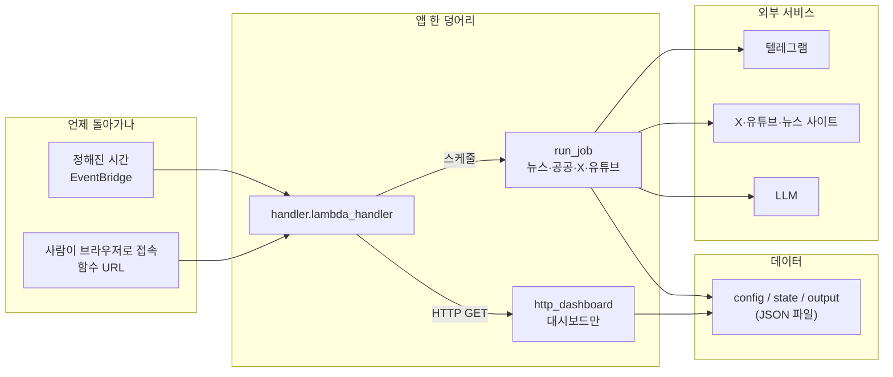
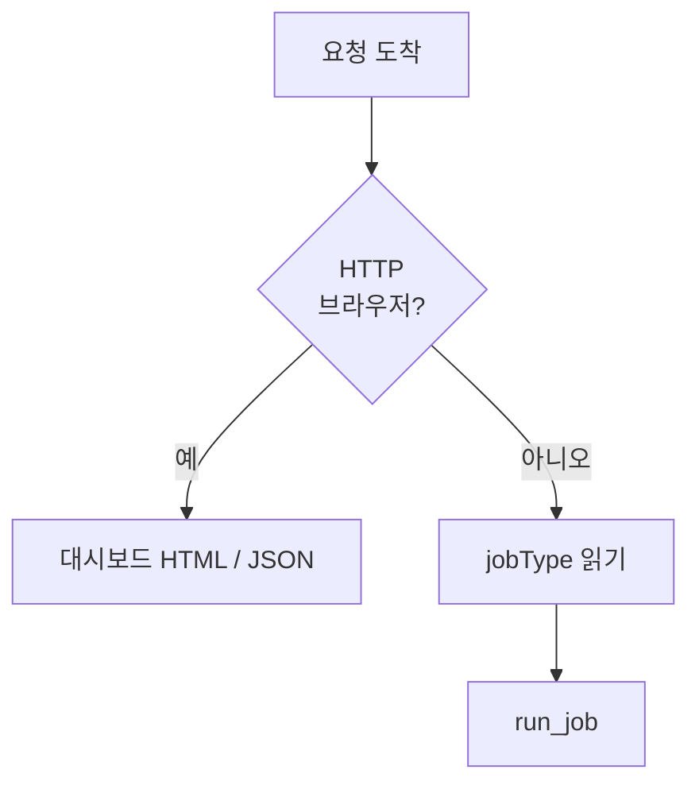
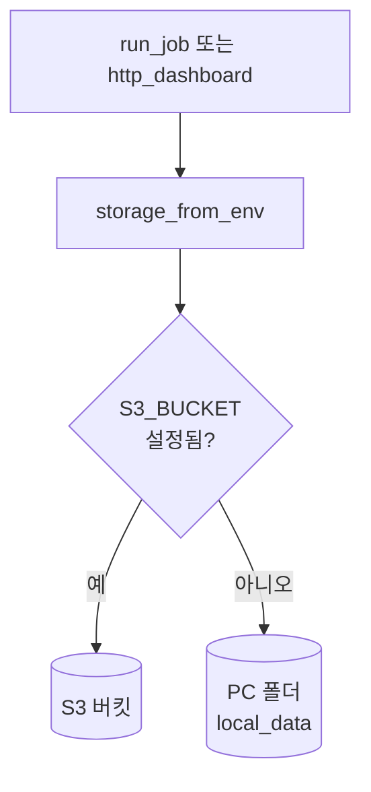

# 대외정책 뉴스 클리핑 (서버리스)

정책·에너지·대외 이슈를 **여러 웹·SNS·유튜브에서 자동으로 모아**, 조건에 맞으면 **텔레그램으로 알려 주는** 프로그램입니다.  
PC에서 먼저 돌려 보고, 같은 코드를 **AWS Lambda**에 올려 **정해진 시간마다** 돌아가게 만들 수 있습니다.

---

## 기능 요건 (이 시스템이 지켜야 하는 것)

| 구분 | 내용 |
|------|------|
| **수집** | 네 가지 작업만 있습니다: `news`(뉴스), `gov`(공공), `x`(X), `youtube`(유튜브). 소스 목록·키워드는 **`config/`** 파일이 기준이며, 임의로 줄이지 않습니다. |
| **텔레그램 알림 형식** | 뉴스·공공: **제목 + 링크** / X: **본문 + 링크 + AI가 판단한 근거** / 유튜브: **요약 + 링크** |
| **대시보드** | 브라우저에서 **읽기만** 가능합니다. HTML 한 페이지와, 같은 내용을 JSON으로 주는 `/api/dashboard`, `/api/items` 가 있습니다. |
| **소스 예시** | 뉴스·공공 사이트 다수, X는 대통령실 계정(`config`의 URL 기준), 유튜브는 KTV 국민방송 채널 등 (`docs/source-inventory.md`에 표로 정리) |

즉, “**정해진 소스에서 가져와서 걸러 보내고, 결과를 한 화면에서 본다**”는 요건을 코드와 설정으로 맞춰 둔 상태입니다.

---

## 설계 원칙 (아키텍처 사상)

이 프로젝트는 **과제·핸즈온**에 맞게 **단순하고 가볍게** 동작하는 것을 먼저 둡니다.

1. **운영 부담을 줄인다**  
   서버를 여러 대 두지 않고, **Lambda 함수 하나**로 스케줄 작업과 웹(대시보드) 요청을 함께 처리합니다. 별도 DB·Redis 없이 **파일(JSON)** 만 씁니다.

2. **로컬과 클라우드가 같은 코드를 탄다**  
   실제 클리핑 로직은 **`run_job` 한 가지**입니다. PC에서는 폴더(`local_data/`)에 저장하고, AWS에서는 **S3**에 같은 경로로 저장합니다. 구분은 환경 변수 **`S3_BUCKET`이 있는지**뿐입니다.

3. **비밀 번호는 코드에 넣지 않는다**  
   로컬은 **`.env`**, AWS는 **Secrets Manager**에 JSON으로 넣고 Lambda가 읽습니다.

4. **화면은 최소로**  
   별도 프론트엔드 빌드 없이, Lambda가 **HTML 문자열**과 **JSON**만 돌려줍니다. API Gateway 없이 **Lambda 함수 URL**로 GET만 엽니다.

5. **AI는 바꿀 수 있게**  
   X·유튜브 후처리에 쓰는 LLM은 **Gemini / Azure OpenAI / OpenAI 호환** 중 환경 설정으로 고릅니다(아래 “환경 변수” 참고).

요약하면, **“함수 하나 + 파일 저장소 + 외부 API”** 로 끝내고, 복잡한 인프라는 넣지 않았습니다.

---

## 아키텍처 개요

### 한눈에 보는 구조



- **입력 두 가지**: (1) 스케줄이 `jobType`을 넣어 Lambda를 부름, (2) 사람이 함수 URL로 **GET**만 함.  
- **출력**: 텔레그램 메시지, 그리고 파일로 남는 **실행 기록·대시보드용 스냅샷**.

### 진입점이 나누는 일

`handler.lambda_handler`가 **먼저** 요청이 HTTP인지 스케줄인지 구분합니다.



- **HTTP**: `local_server.py`도 **같은 `lambda_handler`**를 호출하므로, 로컬과 AWS에서 대시보드 동작이 같습니다.  
- **스케줄**: `news` / `gov` / `x` / `youtube` 중 하나만 실행합니다.

### 데이터는 어디에 쓰이나

DB 대신 **같은 폴더 규칙**을 로컬과 S3 양쪽에 씁니다.



| 경로 | 역할 |
|------|------|
| `config/` | 소스 URL, 키워드, 필터, 프롬프트 |
| `state/` | 어디까지 읽었는지, 이미 보낸 항목, 대시보드용 요약 |
| `output/…` | 실행·항목·실패 로그(날짜별 JSON) |

### Job별로 하는 일 (요약)

| Job | 무엇을 하나 | 텔레그램 |
|-----|-------------|----------|
| `news` / `gov` | 지정 사이트 HTML을 읽고 키워드로 거름 | 제목 + 링크 |
| `x` | X API로 글을 가져오고 LLM이 관련 있으면 통과 | 본문 + 링크 + 근거 |
| `youtube` | KTV 채널에서 검색·메타를 읽고 LLM이 요약 | 요약 + 링크 |

### AWS에 올렸을 때 (`template.yaml`)

- **S3** 버킷 하나, **Lambda** 하나, **EventBridge**로 job마다 다른 주기, **함수 URL**(인증 없음 → 실서비스면 WAF 등으로 보호 권장).  
- Lambda는 Python 3.12, Secrets Manager와 S3 읽기·쓰기 권한이 붙어 있습니다.

### 쓰는 주요 라이브러리

`boto3`, `requests`, `beautifulsoup4`, `lxml`, `openai`, `google-generativeai`, `python-dotenv`, 테스트는 `pytest`.

---

## 로컬 ↔ AWS 전환 (무엇이 바뀌나)

| 환경 | 데이터 저장 | job 실행 | 대시보드 |
|------|---------------|----------|----------|
| **로컬** | `S3_BUCKET` 없음 → `local_data/` | `python cli.py run --job …` | `python local_server.py` → `lambda_handler`와 동일 경로 |
| **AWS** | `S3_BUCKET` 있음 → S3 | EventBridge가 Lambda 호출 | 함수 URL로 GET |

바뀌는 것은 **환경 변수**와 **저장 위치**뿐이고, **`clipper.runner`·`clipper.storage` 로직은 동일**합니다.

---

## 로컬에서 실행하기

```powershell
cd DX_handson
python -m venv .venv
.\.venv\Scripts\Activate.ps1
pip install -r requirements.txt
```

### 환경 설정

1. **`.env.example`**을 복사해 **`.env`**로 저장한 뒤 값을 채웁니다.  
2. `clipper/secrets.py`가 **`python-dotenv`로 `.env`를 자동 로드**합니다.

**자주 쓰는 변수**

- `LOCAL_DATA_ROOT` — 기본 `local_data`  
- `TELEGRAM_BOT_TOKEN`, `TELEGRAM_CHAT_ID`  
- **LLM** — `LLM_PROVIDER`: `auto`(기본) / `gemini` / `azure` / `openai`  
  - `auto`: 유튜브는 `GEMINI_API_KEY`가 있으면 Gemini 우선, X는 Azure → OpenAI → Gemini 순  
- `GEMINI_API_KEY`, 선택 `GEMINI_MODEL` — [Google AI Studio](https://aistudio.google.com/apikey)  
- `AZURE_OPENAI_ENDPOINT`, `AZURE_OPENAI_API_KEY`, (선택) 배포명·버전·토큰 상한  
- `OPENAI_API_KEY`, (선택) `OPENAI_API_BASE`, `OPENAI_MODEL`  
- `TWITTER_BEARER_TOKEN`, `YOUTUBE_API_KEY`

### job 한 번

```powershell
python cli.py run --job news
```

### 로컬 대시보드

```powershell
python local_server.py
# 브라우저: http://127.0.0.1:8765/
```

---

## AWS에 배포하기

1. Secrets Manager에 JSON 시크릿을 만들고 `AppSecretArn`에 연결합니다. (위 변수들과 동일한 키 이름)  
2. `sam build` 후 `sam deploy --guided`  
3. 배포된 Lambda **함수 URL**로 대시보드에 접속합니다.  
4. S3에 `config/`가 비어 있으면 배포 패키지의 `config/`가 한 번 복사됩니다.

---

## 더 읽을 거리

- [구현 계획](docs/implementation-plan.md)  
- [소스 목록(인벤토리)](docs/source-inventory.md)  
- [결정 사항](docs/decisions.md)  
- [운영 런북](docs/runbook.md)

## 테스트

```powershell
pytest -q
```
