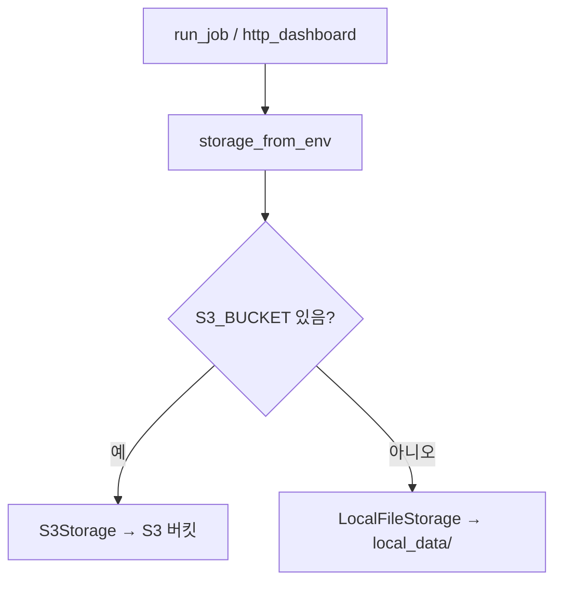
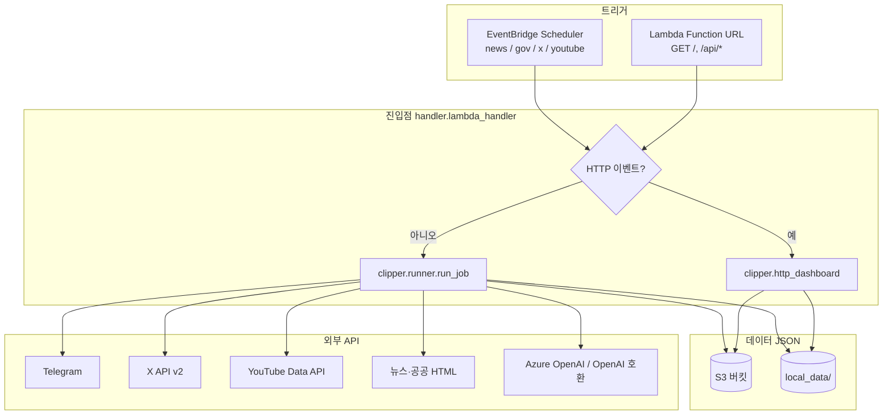

# 대외정책 뉴스 클리핑 (서버리스)

## 이 프로젝트는 무엇인가 (과제 정의)

**대외·에너지·정책 관련 뉴스·공공·SNS·영상**을 정해 둔 소스에서 주기적으로 모으고, 키워드·AI로 걸러 **텔레그램으로 요약 알림**을 보내는 **자동 클리핑 시스템**입니다. 운영자는 **웹 대시보드(읽기 전용)**로 최근 실행·발송·실패를 확인합니다.

- **범위**: 수집 job `news` / `gov` / `x` / `youtube`, 소스·키워드는 `config/`에 정의된 대로 사용합니다.  
- **산출물**: 과제·핸즈온 형태로, **동작을 로컬에서 먼저 검증**하고 **같은 코드를 AWS Lambda에 올려** 스케줄·운영까지 이어지도록 맞춰 두었습니다.

---

## 설계 방향: 로컬에서 테스트 → Lambda로 전환

비즈니스 로직은 **한 벌**이며, **진입점과 저장소만 환경에 따라 바뀝니다.**

| 단계 | 무엇을 쓰나 | 저장소 | 진입점 |
|------|-------------|--------|--------|
| **로컬 개발·테스트** | PC에서 `pytest`, `cli.py`, `local_server.py` | `S3_BUCKET` **미설정** → `local_data/` (`LocalFileStorage`) | `cli.py` → `run_job` / `local_server.py` → **`lambda_handler`와 동일 HTTP 경로** |
| **AWS 운영** | EventBridge 스케줄 + Lambda 함수 URL | `S3_BUCKET` **설정** → S3 (`S3Storage`) | `handler.lambda_handler` → 스케줄은 `run_job`, 브라우저는 `http_dashboard` |

**전환 시 바뀌는 것**

- **환경 변수**: 로컬은 `.env` + (선택) `LOCAL_DATA_ROOT`. Lambda는 `S3_BUCKET`, `APP_SECRET_ARN` 등(배포 템플릿 참고).  
- **저장 위치만** S3 ↔ 로컬 폴더. `clipper.storage.storage_from_env()`가 `S3_BUCKET` 유무로 분기합니다.  
- **HTTP 대시보드**: `local_server.py`가 **실제로 `handler.lambda_handler`를 호출**하므로, 로컬에서 보는 화면과 Lambda 함수 URL로 보는 화면이 **같은 코드 경로**입니다.

**검증 포인트 (코드 기준)**

- 스케줄 실행: `handler.lambda_handler` → `run_job` (`clipper.runner`).  
- 로컬 job: `cli.py` → 동일 `run_job`.  
- HTTP: `handler.lambda_handler` → `handle_http_event` (`clipper.http_dashboard`).

---

## 경량화 구조를 택한 이유

운영·과제 모두 **부담을 줄이기 위해** 아래처럼 최소 구성으로 맞췄습니다.

| 항목 | 선택 |
|------|------|
| **컴퓨트** | Lambda **함수 1개** (스케줄 + HTTP 겸용). 컨테이너·EC2·별도 워커 없음. |
| **데이터** | **DB 없음**. 설정·상태·로그는 전부 **JSON 파일** (S3 또는 `local_data/`). |
| **API 노출** | API Gateway 없이 **Lambda 함수 URL** + GET만 (대시보드·조회 API). |
| **프론트** | SPA 프레임워크 없음. **단일 HTML 문자열** + 필요 시 JSON API. |
| **AWS 리소스 (`template.yaml`)** | S3 버킷 1 + Lambda 1 + EventBridge 스케줄 4 + 함수 URL + Secrets Manager 연동(파라미터). |

---

## 시스템 아키텍처 (검증 요약)

**한 개의 AWS Lambda**가 (1) **스케줄**로 클리핑 job을 돌리고, (2) **HTTP GET**으로 읽기 전용 대시보드를 제공합니다. 설정·실행 상태·로그는 **JSON 파일**로만 다루며 **별도 데이터베이스는 없습니다**.

### 역할 분리

| 구분 | 설명 |
|------|------|
| **데이터 저장** | DB 대신 파일. `config/`, `state/`, `output/` 키 규칙으로 S3 또는 `local_data/`에 저장. |
| **Lambda 하나** | `handler.lambda_handler`가 스케줄 페이로드와 함수 URL 이벤트를 **같은 핸들러**에서 분기. |
| **비밀 정보** | AWS: Secrets Manager(`AppSecretArn`). 로컬: `.env`. |
| **첫 배포** | S3에 `config/`가 없으면 패키지 내 `config/`를 한 번 복사(부트스트랩). |

### 저장소 분기 (로컬 ↔ Lambda)

한 요청·한 job마다 `storage_from_env()`가 **한 번** 스토리지를 고릅니다 (`S3_BUCKET` 유무).



### 전체 논리 구성



### 동작이 갈리는 세 가지 경우

1. **스케줄(EventBridge)** — `template.yaml`의 `rate`/`cron`이 Lambda를 호출하고, 입력에 `jobType`이 있으면 `run_job(storage, job_type)` 실행.  
2. **HTTP(함수 URL)** — GET만. `/`는 HTML 대시보드, `/api/dashboard`, `/api/items`는 JSON. **쓰기·관리 API 없음.**  
3. **로컬** — `python cli.py run --job …`는 동일 `run_job` + 로컬 스토리지. `python local_server.py`는 **`lambda_handler`를 그대로 호출**해 대시보드를 띄움.

### 저장소 (`clipper.storage`)

- `S3_BUCKET`이 있으면 **S3**, 없으면 **`LOCAL_DATA_ROOT`(기본 `local_data`)**.  
- 키 레이아웃은 로컬·S3 **동일** (`config/`, `state/`, `output/…`).

### Job별 처리 요약

| Job | 수집 | 후처리 | 텔레그램 |
|-----|------|--------|----------|
| `news` / `gov` | HTML 파싱 + 키워드 | 중복 제거·체크포인트 | 제목 + 링크 |
| `x` | X API | LLM 관련성 | 본문 + 링크 + 근거 |
| `youtube` | 채널·검색 | LLM 요약 | 요약 + 링크 |

`runner.py`가 `state/dashboard_snapshot.json`, `state/sent_items.json`, `output/…`를 갱신합니다.

### AWS 리소스 (`template.yaml` 기준)

- **S3**: 데이터 버킷(AES256).  
- **Lambda**: Python 3.12, 타임아웃 900초, 메모리 1024MB, Secrets + S3 권한.  
- **함수 URL**: `AuthType: NONE` — 실서비스 시 WAF·인증 등 **별도 보호** 권장.  
- **스케줄**: job별 상이(예: X 10분, 뉴스 4시간 등).

### 사용 라이브러리

- Python 3.12, AWS SAM.  
- `boto3`, `requests`, `beautifulsoup4` / `lxml`, `openai`, `python-dotenv`, 테스트 `pytest`.

---

## 요구 사항 한눈에

- **텔레그램**: 뉴스·공공 **제목+링크**, X **본문+링크+판단 근거**, 유튜브 **요약+링크**  
- **수집 job**: `news`, `gov`, `x`, `youtube` — 소스·키워드는 `config/` 기준(임의 축소 없음).  
- **UI**: HTML 한 페이지 + `/api/dashboard`, `/api/items`

## 로컬에서 실행하기

```powershell
cd DX_handson
python -m venv .venv
.\.venv\Scripts\Activate.ps1
pip install -r requirements.txt
```

### 환경 설정(권장 순서)

1. **`.env.example`**을 복사해 **`.env`**로 두고 값을 채웁니다. (`.env`는 Git에 포함되지 않습니다.)  
2. 이미 `.env`가 있다면 `AZURE_OPENAI_API_KEY`, `TELEGRAM_*`, `TWITTER_BEARER_TOKEN`, `YOUTUBE_API_KEY` 등 **비어 있는 항목만** 발급해 넣습니다.  
3. `clipper/secrets.py` 로드 시 **`python-dotenv`로 `.env`를 자동 로드**합니다.

선택 환경 변수(민감 정보는 AWS에서는 Secrets Manager와 병행):

- `LOCAL_DATA_ROOT` — 기본 `local_data`  
- `TELEGRAM_BOT_TOKEN`, `TELEGRAM_CHAT_ID`  
- **LLM**  
  - **Azure OpenAI(권장)**: `AZURE_OPENAI_ENDPOINT`, `AZURE_OPENAI_API_KEY`, 선택 `AZURE_OPENAI_DEPLOYMENT`(기본 `lewis-gpt-5`), `AZURE_OPENAI_API_VERSION`(기본 `2024-12-01-preview`), `AZURE_OPENAI_MAX_TOKENS`(기본 `4096`)  
  - Azure 미사용 시: `OPENAI_API_KEY`, 선택 `OPENAI_API_BASE`, `OPENAI_MODEL`  
- `TWITTER_BEARER_TOKEN` — X API v2  
- `YOUTUBE_API_KEY` — Data API v3

`AZURE_OPENAI_ENDPOINT`와 `AZURE_OPENAI_API_KEY`가 모두 있으면 X·유튜브 LLM 호출은 **Azure OpenAI**를 사용합니다.

### job 한 번 실행

```powershell
python cli.py run --job news
```

### 로컬 대시보드 (Lambda와 동일 핸들러)

```powershell
python local_server.py
# http://127.0.0.1:8765/
```

## AWS에 배포하기

1. Secrets Manager에 JSON 시크릿 생성 후 `AppSecretArn`에 연결. 예: `TELEGRAM_BOT_TOKEN`, `TELEGRAM_CHAT_ID`, `OPENAI_API_KEY`, `TWITTER_BEARER_TOKEN`, `YOUTUBE_API_KEY`  
2. `sam build` → `sam deploy --guided`  
3. 배포된 Lambda **함수 URL**로 GET `/` 대시보드 접근. 버킷·스케줄·시크릿 권한은 템플릿에 포함.  
4. S3에 `config/`가 없으면 패키지 `config/`가 한 번 복사됩니다.

## 폴더 구조

| 경로 | 역할 |
|------|------|
| `config/` | 소스, 키워드, 필터, 텔레그램, 프롬프트 |
| `state/` | 체크포인트, 발송 이력, 소스 헬스, 대시보드 스냅샷 |
| `output/runs|items|failed/YYYY/MM/DD/` | 실행·항목·실패 로그(JSON) |

## 더 읽을 거리

- [구현 계획](docs/implementation-plan.md)  
- [소스 목록(인벤토리)](docs/source-inventory.md)  
- [결정 사항](docs/decisions.md)  
- [운영 런북](docs/runbook.md)

## 테스트

```powershell
pytest -q
```
